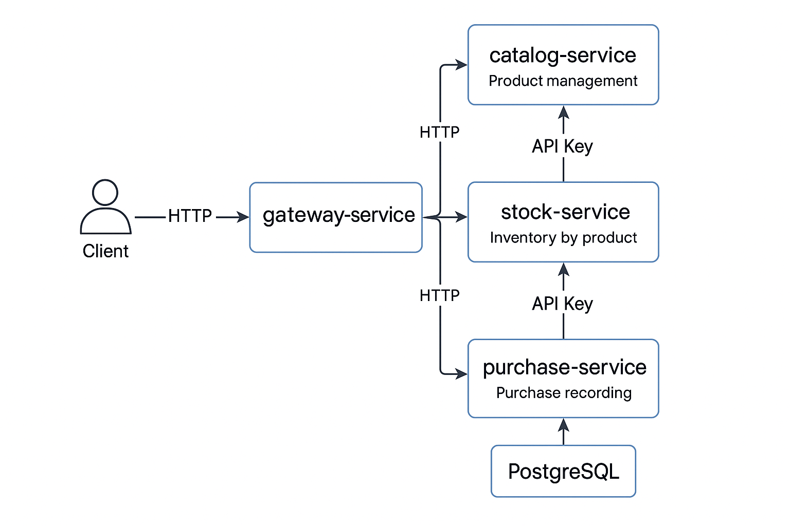

# Inventory Microservices System

Sistema distribuido para la gestión de productos, inventario y compras, siguiendo principios de arquitectura hexagonal, resiliencia, seguridad y buenas prácticas DevOps.

---

## 🧪 Stack Tecnológico

- **Lenguaje:** Java 17
- **Framework:** Spring Boot 3
- **Construcción:** Gradle
- **Arquitectura:** Hexagonal + Microservicios
- **Base de datos:** PostgreSQL
- **Contenedores:** Docker, Docker Compose
- **Pruebas:** JUnit + Mockito
- **Resiliencia:** Resilience4j
- **Documentación:** Swagger / OpenAPI
- **Seguridad:** API Key entre microservicios
- **Comunicación:** HTTP + JSON:API

---

## 🏗️ Arquitectura de Microservicios

### Servicios

- **catalog-service:** Gestión de productos
- **stock-service:** Control de inventario
- **purchase-service:** Registra compras y actualiza inventario
- **gateway-service:** Orquestador de compras + resiliencia + seguridad

## 🧠 Patrones de Diseño Aplicados

Durante el desarrollo de esta solución se aplicaron varios patrones de diseño reconocidos para garantizar una arquitectura sólida, mantenible y escalable. A continuación se describen los más relevantes:

### 1. 🧱 Arquitectura Hexagonal (Ports & Adapters)
Se adoptó una estructura basada en el patrón de **arquitectura hexagonal**, también conocida como Clean Architecture, que separa las responsabilidades en capas:
- **Domain**: contiene la lógica del negocio y entidades puras.
- **Application**: capa de orquestación, servicios de aplicación y uso de puertos.
- **Infrastructure**: conecta la aplicación con el mundo exterior (bases de datos, APIs externas, etc.).
- **Adapter / Controller**: recibe solicitudes del exterior (REST API).

Esto facilita el desacoplamiento, pruebas unitarias e independencia tecnológica.

### 2. 📦 DTO Pattern
Se usaron **Data Transfer Objects (DTOs)** para desacoplar los modelos de dominio de las estructuras de entrada/salida expuestas por los endpoints. Esto protege la lógica del negocio y permite una evolución controlada de las APIs.

### 3. 🔌 Adapter/Client Proxy
Cada microservicio expone su funcionalidad como proveedor de información y también actúa como consumidor de otros servicios mediante **clientes adaptadores** (`RestTemplate`). Este patrón encapsula los detalles de la comunicación externa, manteniendo limpia la lógica interna.

### 4. 🧩 Service Layer
La lógica de negocio no reside en los controladores, sino en una capa de servicios (`ApplicationService` / `Orchestrator`) que actúa como intermediario entre el mundo exterior y el dominio. Esto permite aplicar validaciones, orquestaciones y flujos complejos sin violar la SRP (Single Responsibility Principle).

### 5. 🛡️ Resilience Pattern (Resilience4j)
Se implementaron mecanismos de resiliencia usando **Resilience4j**, específicamente:
- **TimeLimiter** para evitar bloqueos prolongados.
- **Retry** para manejar errores transitorios.
- **Fallback** para retornar respuestas controladas en caso de fallo.
  Esto asegura robustez en la comunicación entre microservicios.

### 6. ⚙️ Configuration as Module
Las configuraciones compartidas como seguridad por API Key, manejo de interceptores o personalización de `RestTemplate`, fueron extraídas a un módulo `config`, cumpliendo el principio DRY y facilitando su reutilización y mantenimiento.

### 7. 🔀 Strategy y Versionado de API (básico)
Se sentaron bases para el versionamiento de APIs mediante una anotación de `@ApiVersion`, permitiendo múltiples versiones en paralelo y facilitando futuras migraciones.


### 🔄 Interacción

```plaintext
CLIENT
  |
  v
GATEWAY (auth, resilience)
  |--------> catalog-service (GET products)
  |--------> stock-service (GET / PUT stock)
  |--------> purchase-service (POST purchase)
```

---

## 🛠️ Instalación y Ejecución

### 1. Clonar el repositorio

```bash
git clone https://github.com/json959/inventoryProject.git
cd inventory-project
```

### 2. Levantar PostgreSQL

```bash
docker-compose up -d postgres
```

> ⚠️ Verifica que el contenedor esté activo con `docker ps`.

### 3. Ejecutar Microservicios

Desde el IDE o terminal:

```bash
cd catalog-service
./gradlew bootRun
```

Repite para:

- `stock-service`
- `purchase-service`
- `gateway-service`

---

## 🔑 Seguridad

### Comunicación entre microservicios con API Key

Cada microservicio requiere una API Key en el header:

```http
x-api-key: secret-key
```

Configurado con un `ApiKeyInterceptor` y validador centralizado.

---

## 🔄 Flujo de Compra

1. Cliente envía compra al **gateway-service**
2. Gateway consulta el stock (stock-service)
3. Verifica disponibilidad y descuenta cantidad
4. Guarda la compra (purchase-service)
5. Devuelve confirmación de compra

---

## 🔐 Módulos de resiliencia

- Timeout y reintentos con `Resilience4j`
- Circuit Breaker en caso de errores repetidos
- Fallbacks definidos para evitar caídas en cascada

---

## 📊 Pruebas


### Integración

- Cada microservicio probado de forma aislada
- Base de datos real en testcontainers o PostgreSQL local

---

## 📄 Documentación

### Swagger UI

Accede a la documentación interactiva en:

- `http://localhost:8080/swagger-ui/index.html` → Catalog
- `http://localhost:8081/swagger-ui/index.html` → Stock
- `http://localhost:8082/swagger-ui/index.html` → Purchase
- `http://localhost:8083/swagger-ui/index.html` → Gateway

---

## 📈 Diagramas

### Interacción de Servicios- flujo de compra




---

## 🤖 Uso de herramientas de IA

Se usó IA para:

- Generar DTOs y pruebas unitarias rápidamente
- Validar estructuras de carpetas por patrón hexagonal
- Optimizar el manejo de errores y circuit breakers
- Generar este `README.md`

---

## 📦 Estrategia de Versionado

- Cada microservicio tiene su propio control de versiones
- Planeación para usar `/v1`, `/v2` en endpoints REST
- Git Flow para ramas: `main`, `develop`, `feature/*`, `release/*`, `hotfix/*`

---

## 📌 Mejoras Futuras

- Reemplazar RestTemplate por WebClient (reactivo)
- Implementar Keycloak o JWT para autenticación completa
- Kubernetes deployment + autoscaling
- Métricas con Prometheus + Grafana
- Pruebas unitarias Cobertura >80%(implementacion de sonar apra cobertura)
- Cambiar a mensajería asíncrona (Kafka o RabbitMQ) en lugar de HTTP


---

## 👨‍💻 Autor

Jeison Barbosa - Ingeniero de Software
✉️ [jdbarbosa95@gmail.com](mailto:jdbarbosa95@gmail.com)  
🔗 [LinkedIn](www.linkedin.com/in/jeison-david-barbosa-moreno)  
📂 GitHub: [tu-repo](https://github.com/json959)